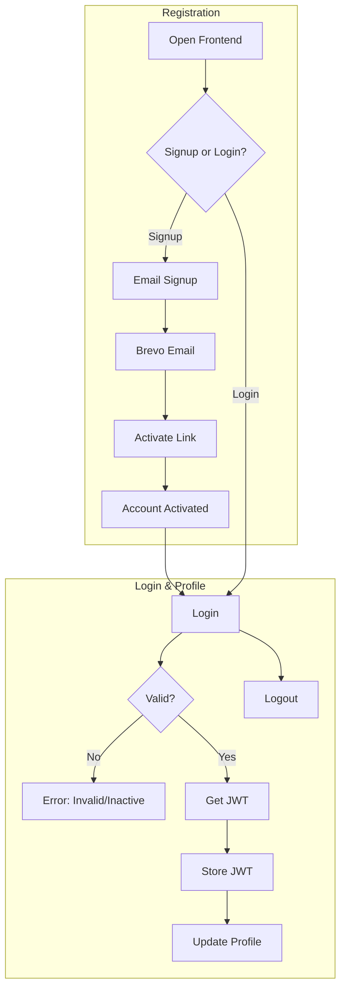

# MERN Trello Clone Project

> **MERN Stack Trello Clone with Real-time Collaboration and Drag-and-Drop Functionality**

[](https://trello-web-eight-self.vercel.app)

## Overview

This project is a **Trello clone built with the MERN stack (MongoDB, Express.js, React, Node.js)**, featuring real-time collaboration, drag-and-drop interfaces, and secure email-based authentication. Designed to demonstrate modern web development skills, it replicates core Trello functionalities like board management, column/card organization, and team invitations, with a focus on user experience and scalability.

**Architecture:**
- **Frontend**: React application with Vite bundler ([https://trello-web-eight-self.vercel.app](https://trello-web-eight-self.vercel.app))
- **Backend**: Node.js + Express API server with MongoDB ([https://trello-ideft-api.onrender.com](https://trello-ideft-api.onrender.com))

**Key Features:**
- 📧 Email registration with Brevo verification (link activation required before login)
- 🌙 Theme modes: Dark, Light, and System (follows device preference)
- 📊 Board management: Create new boards, search boards, delete boards
- 👥 Profile settings: Security (password change), Account (update display name, upload avatar via Cloudinary)
- 🤝 Real-time invitations: Invite users by email with Socket.IO for accept/reject notifications
- 🧩 Drag-and-drop columns and cards using @dnd-kit for smooth interactions
- 🃏 Card details: Add cover images, assign members, descriptions, comments, rename, and delete
- 🔐 JWT-based authentication for secure sessions
- 📱 Responsive UI with Material-UI components
- 🔔 Real-time updates and notifications with React Toastify

## Technical Highlights

- Implemented real-time collaboration using Socket.IO for invitation handling and live updates
- Leveraged @dnd-kit for accessible, performant drag-and-drop across columns and cards
- Integrated Brevo for secure email verification and Cloudinary for avatar/cover uploads
- Managed global state with Redux Toolkit and Redux Persist for persistent user data
- Ensured secure file handling with Multer and validation using Joi

## Technical Implementation

**Frontend** (`http://localhost:5173`)
```bash
cd trell-web
yarn install
yarn dev
```

**Backend** (`http://localhost:8017`)
```bash
cd trello-api
yarn install
yarn dev
```

**Technology Stack:**
- **Frontend**: React 18.2.0, Vite 5.2.0, Material-UI 5.13.0, @dnd-kit/core 6.0.8, Redux Toolkit 2.0.1
- **Backend**: Node.js 18.16.0, Express 4.18.2, MongoDB 6.0.0, Babel transpilation
- **Authentication**: JSON Web Tokens (jsonwebtoken 9.0.2), Brevo (@getbrevo/brevo 2.0.0-beta.4)
- **Real-time**: Socket.IO 4.7.4
- **Deployment**: Vercel (frontend), Render (backend)

## Authentication Flow

This project uses **email-based account verification with JWT authentication**:

1. **Registration** – User registers with email and password via the frontend form.  
2. **Email Verification** – Backend generates a unique token and sends a verification email via **Brevo** containing an activation link.  
3. **Account Activation** – User clicks the link; backend validates the token and marks the account as active in **MongoDB**.  
4. **Login & JWT Issuance** – Activated users can log in. Backend validates credentials and issues a signed **JWT**.  
5. **Session Handling** – Frontend stores JWT securely (local storage) and attaches it to subsequent API requests (e.g., board creation, invitations).  
6. **Profile Security** – Protected actions such as password change, avatar upload, or updating display name require JWT validation.  
7. **Logout** – Frontend clears JWT and local storage, ending the session.  


**Demo Users** 

| Email                   | Password       |
|-------------------------|----------------|
| `nguyencongthong.work@gmail.com`  | `12345678a`    |

**User Flow Summary:**


This project uses **email-based account verification with JWT authentication**. The flow is as follows:




- **Registration** → Email sent → Activate link → Account ready  
- **Login** → JWT issued → Access boards/profile  
- **Invitation** → Real-time Socket.IO notification → Accept/Reject → Shared board access  

## Project Structure

```
project/
├── trell-web/             # React frontend application
├── trello-api/            # Express API server
└── README.md                     
└── README.full.md         # This file
```

## Development & Production Scripts

**Frontend Commands:**
```bash
yarn dev             # Vite dev server with hot reload
npm run build        # Production build optimized for deployment
npm run preview      # Preview production build locally
npm run lint         # ESLint validation for code quality
```

**Backend Commands:**
```bash
yarn dev             # Development with Babel + Nodemon
npm run build        # Clean + Babel transpilation
npm run production   # Build + Production server
npm run lint         # ESLint validation
```

## Key Dependencies

**Frontend:**
- `@mui/material`, `@mui/icons-material`, `@mui/lab` - Material-UI for responsive, themed UI
- `@dnd-kit/core`, `@dnd-kit/sortable`, `@dnd-kit/utilities` - Drag-and-drop functionality
- `@reduxjs/toolkit`, `react-redux`, `redux-persist` - State management with persistence
- `axios` - HTTP client for API calls
- `react-hook-form` - Efficient form handling
- `react-router-dom` - Client-side routing
- `react-toastify` - Toast notifications
- `socket.io-client` - Real-time communication
- `@uiw/react-md-editor`, `rehype-sanitize` - Rich text editing for descriptions
- `cloudinary` (via API) - Image uploads for covers/avatars

**Backend:**
- `express`, `cors`, `cookie-parser` - Core server and middleware
- `jsonwebtoken`, `bcryptjs` - Secure authentication and password hashing
- `@getbrevo/brevo` - Email verification service
- `cloudinary`, `multer`, `streamifier` - File upload handling
- `joi` - Input validation
- `mongodb` - NoSQL database integration
- `socket.io` - Real-time events for invitations
- `lodash`, `uuid` - Utility functions

## Configuration Requirements

This project requires Node.js >= 18.16.0:

```bash
git clone <repository-url>
cd trell-web
yarn install
cd trello-api
yarn install
```

Set up environment variables in `.env` files (e.g., `JWT_SECRET`, `MONGODB_URI`, `BREVO_API_KEY`, `CLOUDINARY_CLOUD_NAME`).

## Deployment

- **Frontend**: Deployed on Vercel with auto-deploy from Git (supports preview branches for CI/CD)
- **Backend**: Deployed on Render with auto-deploy from Git (environment variables for production security)
- **Environment**: Production-ready with secure CORS, rate limiting, and HTTPS enforcement

## Business Value

**Problem Solved:** Replicates Trello's collaborative workflow in a scalable MERN application, addressing needs for real-time team project management with secure user onboarding—ideal for remote teams in 2025's hybrid work environments.

**Technical Benefits:**
- Full-stack MERN implementation with modern tools like Vite for fast builds and Redux for robust state handling
- Real-time features via Socket.IO enhance collaboration, reducing latency in team interactions
- Drag-and-drop UX with @dnd-kit ensures accessibility (ARIA-compliant) and performance
- Secure auth flow with email verification and JWT prevents unauthorized access, aligning with 2025 data privacy standards (e.g., GDPR/CCPA)
- Modular architecture supports easy scaling, such as adding AI-driven task suggestions or integrations

**What I Learned:** Building this project deepened my expertise in real-time systems and drag-and-drop libraries, teaching me to balance frontend performance with backend reliability. It highlighted the importance of secure email workflows and state persistence in user-centric apps, preparing me for full-stack roles emphasizing collaboration tools.

---

**Note:** This MERN Trello Clone showcases practical full-stack skills with real-time collaboration, drag-and-drop, and secure authentication, suitable for modern scalable web development in 2025.
